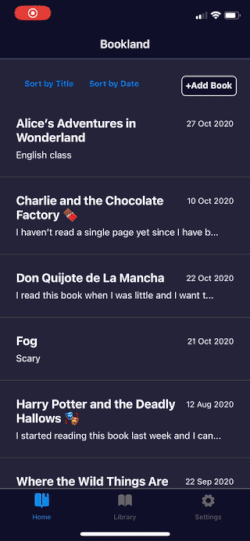

# Diary App

Mobile application with React Native and Expo CLI

- Live version: https://expo.io/@gustavozapata/k1715308-diary-app
- GitHub repository: https://github.com/gustavozapata/diary-app

### Client

#### Technologies

- JavaScript
- React
- React Native
- Expo CLI

#### Dependencies

- react navigation - to create routing and navigation for the app
- async storage - persistent storage
- axios - to make requests to the server

#### Installation

- cd client
- npm install
- npm start

By default the app will fetch data from the node/express app hosted on Heroku.
To change the fetch url go to: client > src > config > config.js and change the 'host' variable

### Server

#### Technologies

- JavaScript
- Node JS
- MongoDB

#### Dependencies

- express - nodejs framework
- mongoose - mongodb framework
- cors - to enable CROSS-origin resource sharing
- dotenv - to access environment variables
- morgan - to log the requests
- nodemon - to watch the server and restart when updating the server

#### Installation

- cd server
- npm install
- npm start

DB_URI is an environment variable used by the server.js file. DB_URI needs to be replaced by your MongoDB database URI. Make sure you create a file .env and add the URI in here: DB_URI=your-db-uri

### APIs

- Google Books API

#### Developed by Gustavo Zapata K1715308
